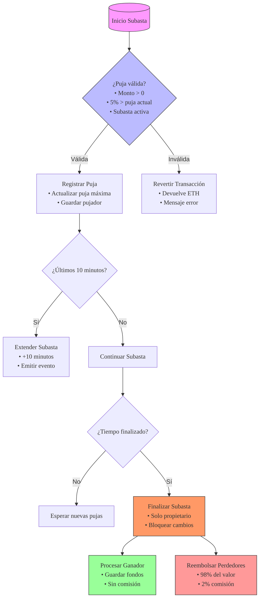

# 📦 SubastaEth - Contrato Inteligente de Subasta

## 📌 Información Esencial

**Red:** Sepolia  
**Contrato:** [`0x145a1f...`](https://sepolia.etherscan.io/address/0x145a1fe17d2a7ea9079aa3e0530b7fab0e285d8a#code)  
**Propietaria:** `0x39581f1c36CfeBfB36934E583fb3e3CE92Ba6c58`  
**Transacción:** [`0x96aed1...`](https://sepolia.etherscan.io/tx/0x96aed14daa1819dbbaee461d04cbb8aa917bd9857ddf2838ae20db2127d24898)

---

## 📝 Descripción General

Contrato inteligente desarrollado para el Trabajo Práctico N.º 2 del Módulo 2, **ETH Kipu**, que implementa un sistema de subastas

---

## 🚀 Características Principales

### 📜 Reglas de la Subasta


### 🔐 Seguridad
- Modificadores para control de acceso (`soloPropietario`)
- Validaciones exhaustivas con mensajes claros en español
- Protección contra reentrancy en transferencias

### 📢 Eventos Clave
- `NuevaOferta(address indexed ofertante, uint256 monto)`
- `SubastaFinalizada(address ganador, uint256 montoFinal)`

---

## 🛠️ Implementación Técnica

### 📦 Estructuras de Datos
```solidity
struct Puja {
    uint256 monto;
    bool reembolsado;
    bool activa;
}
```

### ⚙️ Funciones Principales
- `pujar()` - Permite realizar una oferta
- `retirarExcedente()` - Reembolso parcial durante la subasta
- `finalizarSubasta()` - Finaliza la subasta y procesa pagos
- `obtenerGanador()` - Consulta al ganador actual

---

## 🛠️ 🧠 Diagrama de Flujo 


---

## 🔧 Herramientas Utilizadas
- [Remix IDE](https://remix.ethereum.org/)
- [Solidity v0.8.24](https://docs.soliditylang.org/)
- [NatSpec](https://docs.soliditylang.org/en/latest/natspec-format.html) para documentación
- [Etherscan Sepolia](https://sepolia.etherscan.io/) para verificación del contrato

---

## 🌍 Consideraciones
- Idioma: Todo el código, comentarios, eventos y documentación están redactados en español, en cumplimiento con los requisitos del Trabajo Final - Módulo 2. Se asegura coherencia semántica con los nombres solicitados

---

## 📇 Información del Proyecto
**Estudiante**: Elisa Araya  
**Curso**: ETH Kipu - Ethereum Developer Pack  
**Entrega**: Proyecto Final - Módulo 2  
**GitHub**: [arayamariaelisa](https://github.com/arayamariaelisa)
